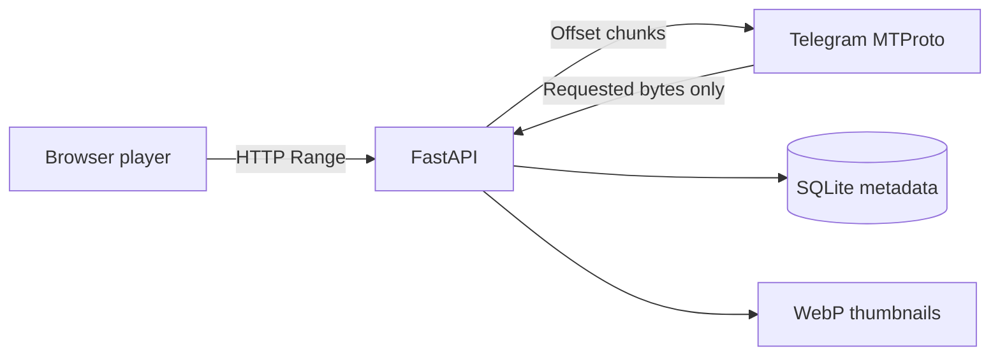

<p align="center">
  
</p>

<h1 align="center">TeleVault</h1>

<p align="center">
  Your private Telegram media chat, transformed into a fast, password-protected,
  YouTube-style streaming library without storing the original files on your server.
</p>

<p align="center">
  <a href="https://github.com/acedev0/televault/actions/workflows/tests.yml"></a>
  <a href="https://github.com/acedev0/televault/releases"></a>
  
  
  
  <a href="LICENSE"></a>
</p>

<p align="center">
  <strong>Made by Ace</strong> · <a href="https://t.me/Aceddev">@Aceddev</a> ·
  <a href="mailto:Acedevmc@gmail.com">Acedevmc@gmail.com</a>
</p>

<p align="center">
  
</p>

## Launch TeleVault

<p align="center">
  <a href="https://replit.com/github.com/acedev0/televault"></a>
  <a href="https://codespaces.new/acedev0/televault?quickstart=1"></a>
  <a href="https://github.com/new?template_name=televault&amp;template_owner=acedev0"></a>
</p>

<p align="center">
  <a href="#one-command-vps-installation"></a>
  <a href="docs/DEPLOYMENT.md#docker-compose"></a>
  <a href="https://github.com/acedev0/televault/releases/latest"></a>
</p>

Replit opens the public repository in a ready-to-run workspace. Press **Run** and complete the
interactive Telegram login in its console. For always-on Replit hosting, select a **Reserved VM**,
use one instance, keep the app private, and back up the `data/` directory. GitHub Codespaces is a
convenient private test environment rather than permanent hosting. A VPS remains the recommended
production option. See the complete [deployment guide](docs/DEPLOYMENT.md).

## Why TeleVault

- **No original-media storage:** video and photo originals remain in Telegram.
- **Real browser seeking:** HTTP byte ranges are translated into offset downloads from Telegram.
- **One continuous library:** search, filter, stable-randomize, and scroll through thousands of items without numbered pages.
- **Complete private player:** seeking, speed, next/previous, autoplay, PiP, theatre/fullscreen modes, Media Session, and YouTube-style keyboard controls.
- **Portrait-safe previews:** generated WebP thumbnails preserve the complete image orientation.
- **Duplicate protection:** repeated Telegram media resolves to one indexed library item.
- **Private by default:** Argon2id login, signed sessions, CSRF checks, rate limiting, and security headers.
- **Simple operations:** one installer and one `televaultctl` command for status, logs, sync, updates, and diagnostics.

## Interface

TeleVault provides a responsive dark media library designed for desktop and mobile:

- YouTube-style cards with full landscape and portrait previews
- one-page infinite scrolling with no numbered pagination, plus a persistent manual “Load more” toggle
- deterministic random mode that shuffles the complete filtered library without repeats between batches
- title, caption, filename, type, size, and date search
- videos, photos, newest, oldest, name, and size filters
- protected watch pages with custom controls, playback speed, autoplay-next, PiP, theatre mode, and fullscreen
- keyboard control with Space/K, arrow keys, J/L, M, F, N/P, number seeking, and speed shortcuts
- live Telegram sync progress without exposing API credentials

## One-command VPS installation

Log in to Ubuntu, Debian, AlmaLinux, or Rocky Linux as root and run:

```bash
bash <(curl -fLsS --proto '=https' --tlsv1.2 https://raw.githubusercontent.com/acedev0/televault/main/install.sh)
```

The wizard asks for:

1. Telegram API ID
2. Telegram API hash
3. phone number, OTP, and optional Telegram 2FA password
4. chat username, invite link, or numeric ID
5. website port — default `8181`
6. website username and password

It scans the selected chat, installs a non-root systemd service, opens the selected UFW port when
UFW is active, and prints the final address.

### Update an existing installation

```bash
sudo televaultctl update
```

You can also run the public installer again. Existing Telegram authorization, media index, port,
and website credentials are retained:

```bash
curl -fLsS --proto '=https' --tlsv1.2 https://raw.githubusercontent.com/acedev0/televault/main/install.sh | sudo bash
```

Enable a daily update check once; unchanged installations are not restarted:

```bash
sudo televaultctl auto-update enable
```

## Replit setup

1. Select **Open in Replit** above.
2. Wait for the GitHub import to finish.
3. Press **Run**.
4. Enter the Telegram API ID, API hash, phone, OTP, chat, port, and website login in the console.
5. Open the web preview after TeleVault prints that it is ready.

The included `.replit`, `replit.nix`, and `scripts/replit-run.sh` configure Python and start the
same interactive setup used on a VPS. Do not place Telegram credentials in source code or commit
the generated `data/` directory.

## What stays on the server

| Item | Stored? | Location/behaviour |
| --- | --- | --- |
| Original videos | No | Range-streamed from Telegram |
| Original photos | No | Fetched into memory when viewed |
| Small WebP thumbnails | Yes | `data/thumbnails/` |
| Search metadata | Yes | SQLite database |
| Telegram authorization | Yes | Encrypted session data |
| API hash | Yes | Encrypted configuration |
| Website password | Hash only | Argon2id |

The encryption key and encrypted values are both on the same host with restrictive permissions.
This protects copied files and casual disclosure, but a root-level server compromise can access a
running application. Protect and back up the entire data directory together.

## Streaming model



TeleVault does not transcode video. The browser must support the original container and codec;
MP4 with H.264/AAC has the widest browser compatibility. Telegram may return temporary flood waits
under heavy use, so TeleVault uses one persistent account session and conservative concurrency.
Read the [architecture guide](docs/ARCHITECTURE.md) for the complete request and storage flow.

## Deployment choices

| Platform | Support | Persistence | Best use |
| --- | --- | --- | --- |
| Linux VPS | Recommended | `/var/lib/televault` | Private always-on production |
| Docker Compose | Supported | Bind mount `./data:/data` | Portable self-hosting |
| Replit workspace | Supported | Workspace `data/` | Easy setup and personal testing |
| Replit Reserved VM | Experimental | Back up before republishing | Always-on Replit hosting |
| GitHub Codespaces | Development | Persistent codespace workspace | Private testing/development |
| Serverless platforms | Not supported | No durable process/session | Not suitable for MTProto streaming |

Only run one TeleVault process against one data directory and Telegram session. Review
[deployment details](docs/DEPLOYMENT.md) before moving an existing installation.

## Management command

```text
televaultctl status       show service status
televaultctl logs         follow live logs
televaultctl restart      restart safely
televaultctl sync         index newer Telegram media
televaultctl full-sync    re-read the complete chat
televaultctl doctor       test configuration and Telegram access
televaultctl configure    repeat interactive setup
televaultctl update       install the latest GitHub version
televaultctl auto-update  enable, disable, or inspect automatic updates
televaultctl version      show the installed version
televaultctl uninstall    remove TeleVault (add --yes for immediate removal)
```

`televaultctl update` checks GitHub first, keeps `/var/lib/televault` unchanged, and rolls the app
back to its previous Git revision if installation fails. To permanently remove the site, Telegram
session, index, thumbnails, service, and firewall rule:

```bash
sudo televaultctl uninstall --yes
```

## Docker Compose

```bash
docker compose build
docker compose run --rm televault python -m televault --data-dir /data setup
docker compose up -d
docker compose logs -f
```

Open `http://YOUR-SERVER-IP:8181` unless you selected another mapped port. See
[Docker deployment](docs/DEPLOYMENT.md#docker-compose) for port and volume details.

## Security and HTTP

TeleVault supports plain HTTP for private networks, but HTTP does not encrypt the website password
or media in transit. Restrict the port to your IP, use WireGuard/Tailscale, or create an SSH tunnel:

```bash
ssh -L 8181:127.0.0.1:8181 root@YOUR-SERVER-IP
```

Then open `http://127.0.0.1:8181`. Read [SECURITY.md](SECURITY.md) before exposing TeleVault to a
network you do not control.

## Development

```bash
python3 -m venv .venv
.venv/bin/python -m pip install -r requirements-dev.txt
.venv/bin/python -m pytest -q
.venv/bin/python -m compileall -q televault
bash -n install.sh start.sh scripts/*.sh
```

Start a local configured instance with `./start.sh`. GitHub Codespaces automatically installs the
development requirements and forwards port `8181`.

## Project structure

```text
televault/      FastAPI app, Telegram client, indexer, database, templates, and static UI
scripts/        Replit launcher, release packager, and televaultctl management command
docs/           Architecture, deployment, and troubleshooting guides
assets/         Generated TeleVault repository artwork
pytests/        Offline backend, security, streaming, and thumbnail tests
.github/        CI, dependency updates, and contribution templates
```

## Documentation

- [Deployment guide](docs/DEPLOYMENT.md)
- [Architecture](docs/ARCHITECTURE.md)
- [Troubleshooting](docs/TROUBLESHOOTING.md)
- [Security policy](SECURITY.md)
- [Contributing](CONTRIBUTING.md)
- [Support](SUPPORT.md)

## Responsible use

Telegram access is performed using your own user account. Use TeleVault only with media you are
authorized to access, follow Telegram's Terms of Service, and comply with applicable copyright law.
Never publish your API hash, encrypted session files, master key, or `data/` directory.

## License

Released under the [MIT License](LICENSE). Copyright © 2026 Ace.
