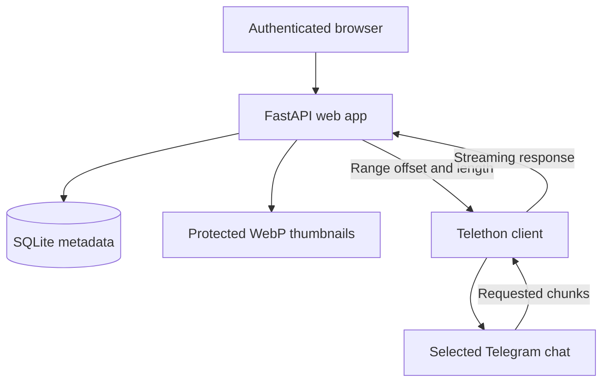

# TeleVault architecture

TeleVault is a single-process FastAPI application backed by one Telegram user session and one
SQLite database. Original photos and videos stay in the selected Telegram chat.

## Request flow



## Components

| Component | Responsibility |
| --- | --- |
| `televault/app.py` | Authentication, HTML routes, sync API, thumbnails, photo delivery, and range streaming |
| `televault/telegram_client.py` | Persistent Telethon connection, chunk downloads, photos, and preview generation |
| `televault/indexer.py` | Full/incremental chat scans, metadata extraction, duplicate filtering, and thumbnails |
| `televault/database.py` | SQLite schema, search, deterministic seeded shuffle, ordered watch playlists, and statistics |
| `televault/config.py` | Encrypted configuration/session storage and restrictive filesystem permissions |
| `televault/security.py` | Argon2id password hashing and login rate limiting |
| `televault/templates/` | Password page, infinite-scroll library, and media watch page |
| `televault/static/` | Responsive UI, custom video player, keyboard/Media Session controls, sync, and infinite loading |

## Indexing

1. Telethon reads messages from the configured chat.
2. The indexer accepts Telegram photos and video documents.
3. It records title, filename, caption, type, size, dimensions, duration, and message date.
4. A key based on the Telegram media ID collapses repeated copies of the same media.
5. Telegram's photo or document preview is converted into a small orientation-preserving WebP.
6. Incremental scans remember the highest processed Telegram message ID.

The browser receives 36 cards initially. An authenticated HTML endpoint supplies additional
batches as an intersection observer approaches the bottom of the same page. Turning infinite
scroll off keeps the same endpoint behind a manual “Load more” control; numbered pages are never
introduced. Random mode hashes each media id with a session seed, creating one stable permutation
across every batch so the feed does not repeat or reorder while scrolling.

## Video streaming

The browser sends a standard `Range` request. TeleVault validates the range and passes its byte
offset to Telethon's downloader. It returns `206 Partial Content`, `Content-Range`, exact
`Content-Length`, and `Accept-Ranges: bytes` without creating a complete local video file.

The browser player uses the native media element behind same-origin custom controls. Playback
speed, seek, volume, fullscreen, picture-in-picture, theatre mode, next/previous navigation,
autoplay-next, keyboard shortcuts, and Media Session handlers do not send media to a third party.

Only a small number of streams may run concurrently. Telegram flood waits and network limits still
apply. TeleVault does not transcode unsupported browser codecs.

## Photo delivery

When an authenticated browser opens a photo, TeleVault downloads it into memory and returns it with
`Cache-Control: private, no-store`. The original photo is not written to disk.

## Stored state

```text
data/
├── .master_key              local encryption key (0600)
├── secrets.enc              encrypted API/session/web configuration (0600)
├── runtime.env              data path and selected port (0600)
├── televault.db             SQLite metadata
└── thumbnails/              small protected WebP previews
```

The key and ciphertext living on the same host is appropriate for protecting backups and accidental
disclosure, not for surviving root compromise. Treat the complete directory as sensitive.

## Security boundaries

- All library, media, thumbnail, status, and stream routes require the website session.
- Passwords are stored only as Argon2id hashes.
- Cookies are signed, HTTP-only, and SameSite strict.
- Login, logout, and sync use CSRF protection.
- Login attempts are rate limited.
- CSP, anti-framing, MIME-sniffing, referrer, and permissions headers are applied centrally.
- The systemd unit runs as an unprivileged user with a restricted writable path.

Plain HTTP does not protect traffic between the browser and server. Add a private tunnel or VPN at
the network boundary when remote traffic crosses an untrusted network.
